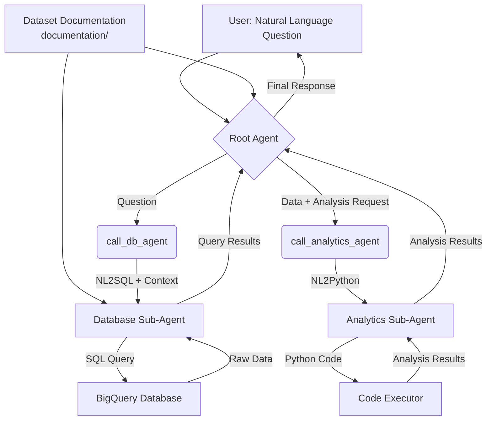

# SQL ADK Agent with Multi-Agent System

This project implements a multi-agent system using Google's Agent Development Kit (ADK) for intelligent SQL analysis and BigQuery integration. The system provides automated Terraform deployment and supports BigQuery scopes for comprehensive data analysis.

## 🏗️ System Architecture

The system consists of:

1. **Root Agent**: Main orchestrator that receives user questions
2. **Database Agent**: Specialized in translating natural language to SQL and querying BigQuery
3. **Analytics Agent**: Performs advanced data analysis using Python when needed

## 🔄 How It Works



## 🚀 Deployment Options

### Option 1: Terraform Automation (Recommended)

Complete infrastructure automation with Terraform that handles OAuth, APIs, IAM, and agent deployment.

#### Prerequisites

- **Google Cloud Project** with billing enabled
- **Terraform** v1.0+ installed
- **Google Cloud CLI** installed and authenticated
- **Python 3.7+** for deployment scripts

#### OAuth Client Setup (One-time)

Since BigQuery scopes aren't supported by Terraform's workforce identity federation, create the OAuth client manually:

1. Go to [Google Cloud Console Credentials](https://console.cloud.google.com/apis/credentials)
2. Click **"+ CREATE CREDENTIALS"** → **"OAuth client ID"**
3. Choose **"Web application"** type
4. Set **Name**: `SQL ADK Agent OAuth Client`
5. Under **Authorized redirect URIs**, add:
   ```
   https://vertexaisearch.cloud.google.com/oauth-redirect
   ```
6. Leave **Authorized JavaScript origins** empty
7. Click **"CREATE"** and copy the **Client ID** and **Client Secret**

#### Terraform Deployment

1. **Configure Variables**:
   ```bash
   cd terraform/
   cp terraform.tfvars.example terraform.tfvars
   ```

2. **Edit `terraform.tfvars`** with your values:
   ```hcl
   # Google Cloud Configuration
   google_cloud_project        = "your-project-id"
   google_cloud_project_number = "123456789012"
   google_cloud_location       = "us-central1"
   google_cloud_storage_bucket = "your-staging-bucket"

   # OAuth Client Credentials (from manual setup)
   oauth_client_id     = "your-client-id.apps.googleusercontent.com"
   oauth_client_secret = "your-client-secret"

   # AgentSpace Configuration
   app_id             = "your-agentspace-app-id"
   agent_display_name = "SQL ADK Agent"

   # BigQuery Configuration
   bq_dataset_id = "your-dataset-id"
   bq_project_id = "your-bigquery-project-id"

   # Agent Configuration
   auth_id = "your-auth-id"
   ```

3. **Deploy**:
   ```bash
   terraform init
   terraform plan
   terraform apply
   ```

**What Gets Automated:**
- ✅ Google Cloud APIs (aiplatform, discoveryengine, storage, iam, compute)
- ✅ IAM Permissions (all required service account roles)
- ✅ Agent Engine Deployment (complete Vertex AI deployment)
- ✅ AgentSpace Integration (full agent registration)
- ✅ Environment Management (all variables from terraform.tfvars)
- ✅ Lifecycle Management (proper cleanup on destroy)

#### Cleanup
```bash
terraform destroy
```

### Option 2: Cloud Build (Legacy)

The original Cloud Build deployment method is still available but requires manual OAuth setup.

**Requirements:**
- All Terraform prerequisites
- Manual OAuth client creation (same as above)
- Cloud Build API enabled

**Deploy:**
1. Configure variables in `cloudbuild.yaml`
2. Run: `gcloud builds submit --config cloudbuild.yaml .`

## 📚 Dataset Documentation Setup

Configure dataset documentation in the `documentation/` folder to improve agent performance:

### Recommended Structure

```
documentation/
├── dataset-overview.md          # Business context and dataset overview
├── tables-schema.md             # Detailed table structures and relationships
├── star-schema.md               # Dimensional modeling (facts and dimensions)
├── business-metrics.md          # KPIs and business metrics definitions
├── data-dictionary.md           # Column meanings and data dictionary
└── example-queries.sql          # Common query examples and patterns
```

### Content Guidelines

Include comprehensive information about:

#### **Table Metadata**
- Table purposes and relationships
- Primary and foreign keys
- Data integrity rules
- Cardinality information

#### **Star Schema & Dimensional Modeling**
- Fact and dimension table identification
- Dimensional hierarchies
- Pre-computed aggregations
- Calculated measures and metrics

#### **Business Metrics & KPIs**
- Precise indicator definitions
- Complex metric calculation formulas
- Business-specific rules
- Important filters and segmentations

#### **Query Examples**
- Common SQL queries for frequent use cases
- Complex queries with joins and aggregations
- Domain-specific analysis patterns
- Recommended query patterns

#### **Data Dictionary**
- Detailed column meanings
- Categorical field possible values
- Units of measure and formats
- Data validation rules

#### **Domain Context**
- Business or application area information
- Domain-specific terminology
- Seasonal patterns and temporal considerations
- Data limitations and particularities

### Example Content

**File: `documentation/business-metrics.md`**
```markdown
# Business Metrics

## Revenue
- **Definition**: Total sales amount in a period
- **Formula**: SUM(orders.total_amount)
- **Filters**: Only orders with status 'completed'

## Customer Lifetime Value (CLV)
- **Definition**: Total value spent by a customer during relationship
- **Formula**: SUM(orders.total_amount) WHERE customer_id = X
- **Notes**: Consider only orders from last 24 months
```

## 🛠️ Local Development

For local development and testing:

1. **Environment Setup**:
   ```bash
   poetry shell
   poetry install
   ```

2. **Authentication**:
   ```bash
   gcloud auth application-default login
   ```

3. **Environment Variables**:
   Create a `.env` file with necessary variables or configure them in your shell.

## 📁 Project Structure

```
sql_agent/
├── agent.py                    # Main root agent orchestrator
├── prompt.py                   # Agent prompts and instructions
├── tools.py                    # Agent tools and utilities
├── cache.py                    # Cache management (currently disabled)
├── sub_agents/
│   ├── bigquery/
│   │   ├── agent.py           # BigQuery database agent
│   │   ├── tools.py           # BigQuery-specific tools
│   │   ├── prompts.py         # BigQuery agent prompts
│   │   ├── callbacks.py       # Agent callbacks (disabled)
│   │   └── chase_sql/         # CHASE NL2SQL implementation
│   └── analytics/
│       ├── agent.py           # Analytics/Python agent
│       └── prompts.py         # Analytics agent prompts
├── utils/
│   └── utils.py               # Utility functions
deployment/
├── deploy.py                   # Python deployment script
└── undeploy.py                # Cleanup script
terraform/
├── main.tf                     # Main Terraform configuration
├── variables.tf                # Variable definitions
├── outputs.tf                  # Output definitions
├── versions.tf                 # Provider version requirements
└── terraform.tfvars.example   # Example variables file
documentation/                  # Dataset documentation for agent context
├── *.md                       # Markdown documentation files
└── *.sql                      # SQL example files
```

## 🔧 Configuration

### Key Environment Variables

- `GOOGLE_CLOUD_PROJECT`: GCP project ID
- `BQ_DATASET_ID`: BigQuery dataset ID
- `BQ_PROJECT_ID`: BigQuery project ID
- `ROOT_AGENT_MODEL`: Model for root agent (default: gemini-2.5-flash)
- `BIGQUERY_AGENT_MODEL`: Model for BigQuery agent
- `ANALYTICS_AGENT_MODEL`: Model for analytics agent
- `NL2SQL_METHOD`: NL2SQL method (CHASE or BASELINE)

### OAuth Scopes

The manually created OAuth client supports all required scopes:
- `openid`
- `https://www.googleapis.com/auth/userinfo.email`
- `https://www.googleapis.com/auth/userinfo.profile`
- `https://www.googleapis.com/auth/bigquery`

## 🚨 Troubleshooting

### Common Issues

1. **OAuth Client Errors**: Verify redirect URI matches exactly
2. **Permission Errors**: Check IAM roles are applied correctly
3. **API Errors**: Ensure all APIs are enabled with propagation time
4. **Cache Errors**: Cache implementation has been disabled to prevent AttributeError

### Support

- Check deployment logs during `terraform apply`
- Verify OAuth client configuration in Google Cloud Console
- Ensure all required APIs are enabled
- Review IAM permissions for service accounts

## 📊 Performance Impact of Documentation

Well-structured documentation results in:
- **Higher precision** in SQL query generation
- **Better interpretation** of ambiguous questions
- **More contextualized responses** for specific domains
- **Reduced errors** in complex queries
- **Improved user experience** with more relevant answers
